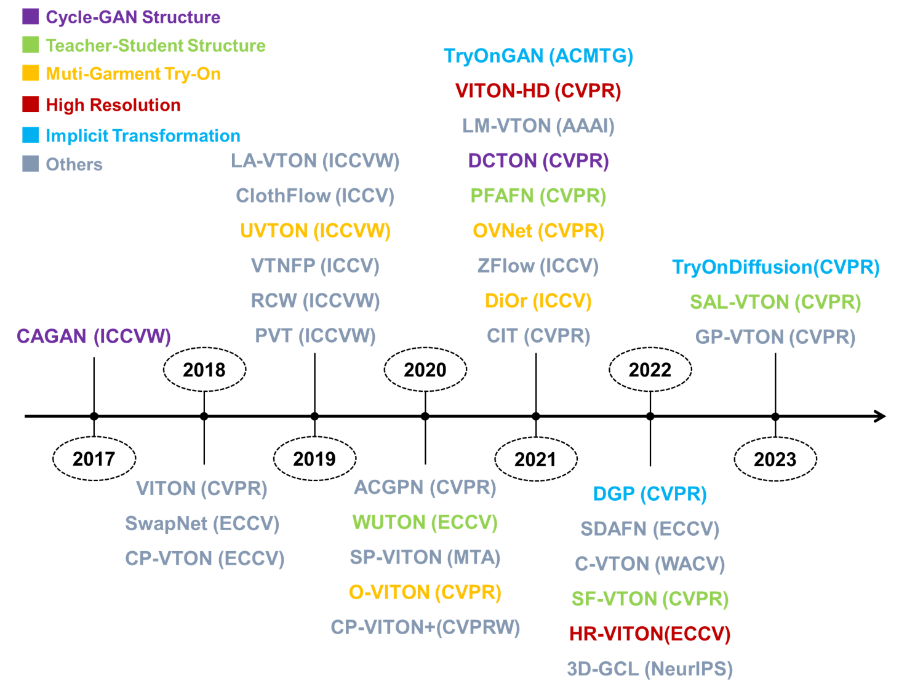
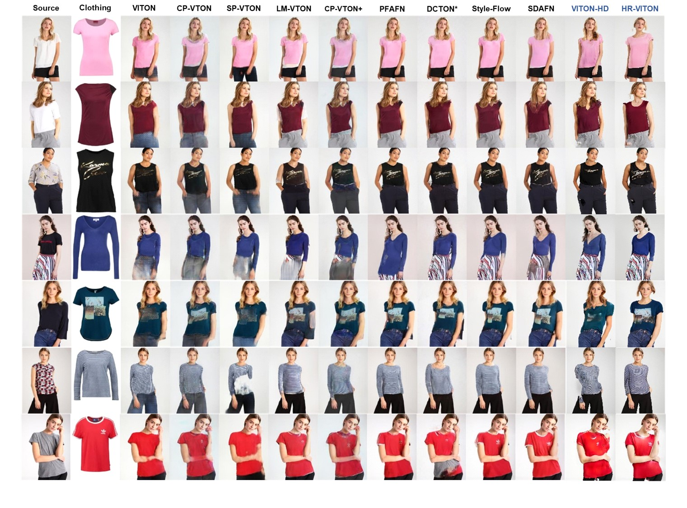
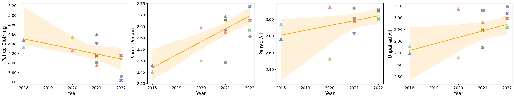

# Image-Based Virtual Try-On: A Survey

This repository corresponds to the paper [**"Image-Based Virtual Try-On: A Survey"**](http://arxiv.org/abs/2311.04811).
If you find our survey useful for your research, please cite the following paper:

```
@misc{Image_Based_Virtual_Try-On_A_Survey,
      title={Image-Based Virtual Try-On: A Survey}, 
      author={Dan Song and Xuanpu Zhang and Juan Zhou and Weizhi Nie and Ruofeng Tong and An-An Liu},
      year={2023},
      eprint={2311.04811},
      archivePrefix={arXiv},
      primaryClass={cs.CV}
}
```


## ⏲️ The Timeline of virtual try-on papers

We have listed some of the most representative works in the field of virtual fitting from recent years.




## 🔍 Experiments

### Data prepare

To ensure a fair test for each model, we produced a high-resolution (1024x768) version of the [**VITON**](https://github.com/xthan/VITON). dataset, following the data preprocessing method of [**VITON-HD**](https://github.com/shadow2496/VITON-HD).

- 14221 train
  - images
  - cloth
  - segmentation
  - densepose
  - keypoints
  - agnostic-person
- 2032 test

High-resolution [**Dataset(Coming Soon)**](https://github.com/little-misfit/Survey-Of-Virtual-Try-On).

### Experiment Results

We evaluated the models through two perspectives: visual results and quantitative metrics.

Visual results:


More visual results from [**here(Coming Soon)**](https://github.com/little-misfit/Survey-Of-Virtual-Try-On).

Quantitative metrics:
SSIM:

IS:

FID:

LPIPS:

Semantic Score:


## Papers & Data Sets

<details><summary>Papers</summary>
<table class="tg">
<thead>
  <tr>
    <th class="tg-baqh" align="center" rowspan="2">model</th>
    <th class="tg-0lax" align="center" rowspan="2">Release Time</th>
    <th class="tg-0lax" align="center" rowspan="2">Paper</th>
    <th class="tg-0lax" align="center" rowspan="2">Code</th>
  </tr>
  <tr>
  </tr>
</thead>
<tbody>
  <tr>
    <td class="tg-baqh" align="center">CAGAN</td>
    <td class="tg-0lax" align="center">2017</td>
    <td class="tg-0lax" align="center"><a href="https://arxiv.org/abs/1709.04695">Paper</a></td>
    <td class="tg-0lax" align="center">-</td>
  </tr>


</tbody>
</table>
</details>

<details><summary>Data Sets</summary>
<table class="tg">
<thead>
  <tr>
    <th class="tg-baqh" align="center" rowspan="2">Data set</th>
    <th class="tg-0lax" align="center" rowspan="2">Release Time</th>
    <th class="tg-0lax" align="center" rowspan="2">Resolution</th>
	<th class="tg-0lax" align="center" rowspan="2">Quantity Train/Test</th>
    <th class="tg-0lax" align="center" rowspan="2">Link</th>
  </tr>
  <tr>
  </tr>
</thead>

<tbody>
  <tr>
    <td class="tg-baqh" align="center">VITON</td>
    <td class="tg-0lax" align="center">2018</td>
    <td class="tg-0lax" align="center">256*192</td>
	<td class="tg-0lax" align="center">14221/2032</td>
    <td class="tg-0lax" align="center"><a href="https://github.com/xthan/VITON">Link</a></td>
  </tr>

</tbody>
</table>
</details>


## Acknowledgments

We acknowledge the contributions of [**awesome-virtual-try-on**](https://github.com/minar09/awesome-virtual-try-on) to the community, which saved us time in collecting literature.

